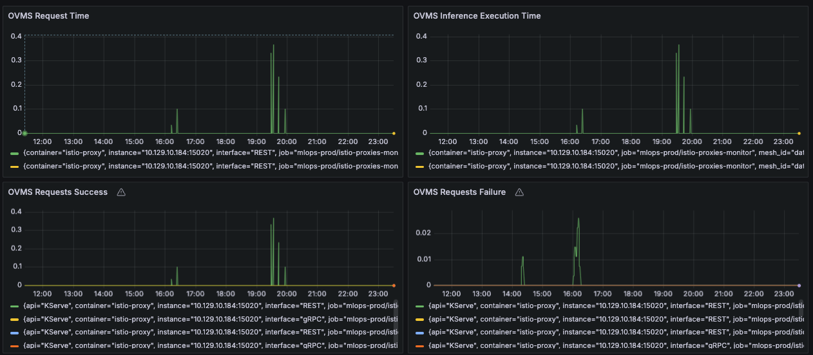

# RHOAI Metrics Dashboard for Single Serving Models

Enable RHOAI User Workload Metrics for Single Serving Models

## Prerequisites

- OpenShift 4.10 or later
- OpenShift AI 2.10+ installed
- OpenShift AI KServe installed and configured
- NVIDIA GPU Operator installed and configured

## Installation

* [Configure Monitoring for the Single Model Serving Platform](https://docs.redhat.com/en/documentation/red_hat_openshift_ai_self-managed/2.11/html/serving_models/serving-large-models_serving-large-models#configuring-monitoring-for-the-single-model-serving-platform_serving-large-models)
* [Configure GPU Monitoring Dashboard](https://docs.nvidia.com/datacenter/cloud-native/openshift/23.9.2/enable-gpu-monitoring-dashboard.html)
* [Install the RHOAI Metrics Grafana and Dashboards for Single Serving Models](./rhoai-uwm-grafana/README.md)

## Usage

Grab the Grafana route and open it in a browser:

```md
NS="user-grafana"
GRAFANA_URL=$(oc get route -n $NS grafana-route -o jsonpath='{.spec.host}')
echo $GRAFANA_URL
```

### vLLM Dashboard

Within the Grafana Dashboard, go to Dashboards and select the `vLLM` dashboard:


### OpenVino Dashboard

Within the Grafana Dashboard, go to Dashboards and select the `OVMS` dashboard:


